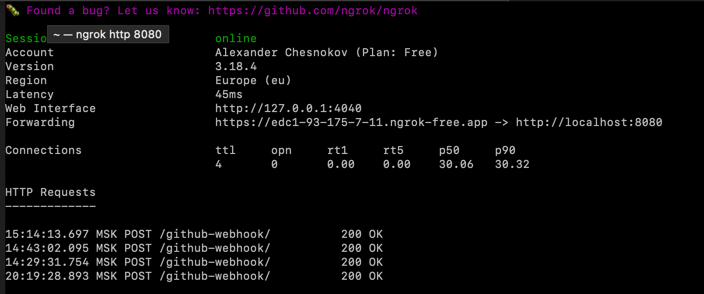
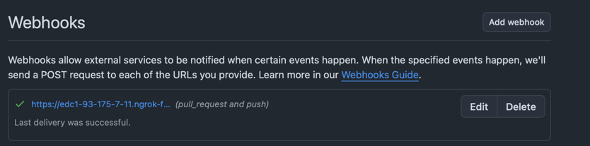
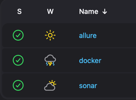
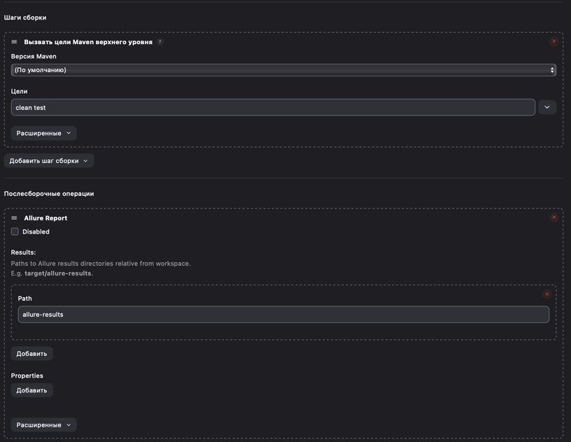
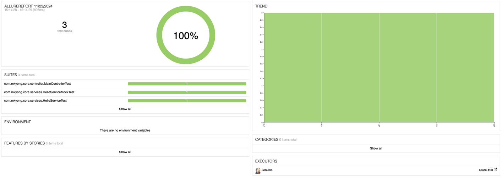
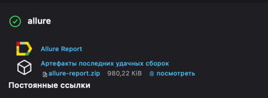
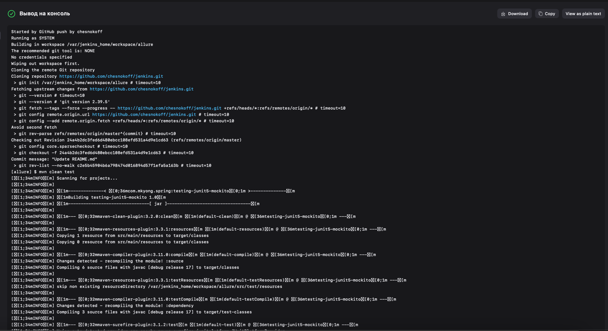
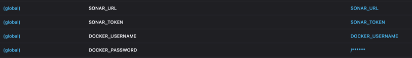
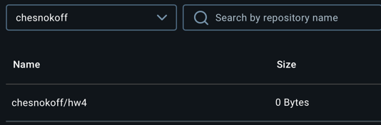

# Jenkins

1) Запускаем докер компоуз с дженкинсом, сонаром и бд
2) Запускаем ngrok командой `ngrok http 8080` чтобы пробросить дженкинс в глобальную сеть
3) Прописываем url в webhook: 
4) Открываем jenkins. В нем сделал три задачи  
5) Allure. Сделал фристайлом 

пример лога 
6) Sonar. Здесь уже пайплайн джоба. Сразу отмечу, что я для диплома арендую удаленный сервер, где уже есть равзвернутый сонар,
поэтому решил заюзать его. Ну а для этого по-хорошему надо прятать URL сервера, поэтому в Credentials добавил разные secrets 
Сам скрипт
```
pipeline {
    agent any
     environment {
        SONAR_URL = credentials('SONAR_URL')  // Извлекаем Sonar URL из Jenkins Credentials
        SONAR_TOKEN = credentials('SONAR_TOKEN')    // Извлекаем Sonar Token из Jenkins Credentials
    }

    stages {
        stage("Pulling") {
            steps {
                git "https://github.com/chesnokoff/jenkins.git"
            }
        }
        
        stage("Sonar") {
            steps {
                    sh '''
                        mvn clean verify sonar:sonar \
                        -Dsonar.projectKey=hw4 \
                        -Dsonar.projectName='hw4' \
                        -Dsonar.host.url="${SONAR_URL}" \
                        -Dsonar.token="${SONAR_TOKEN}"
                    '''
                
            }
        }
    }
}
```
7) Заключительный пункт - пуш в докер регистри. Тут тоже пайплайн джоба с секретами. Итоговый скрипт
```
pipeline {
    agent any

    stages {
        stage("Pulling") {
            steps {
                git "https://github.com/chesnokoff/jenkins.git"
            }
        }

        stage("Build JAR") {
            steps {
                sh 'mvn clean package -DskipTests'
            }
        }

        stage("Build Docker Image") {
            steps {
                script {
                    sh '''
                        docker build -t hw4:latest .
                    '''
                }
            }
        }

        stage("Push Docker Image") {
            steps {
                script {
                    sh '''
                        docker login -u ${DOCKER_USERNAME} -p ${DOCKER_PASSWORD}
                        docker tag hw4 ${DOCKER_USERNAME}/hw4:latest 
                        docker push hw4:latest
                    '''
                }
            }
        }
    }
}
```
Докерфайл, который заранее положил внутрь контейнера дженкинса:

```dockerfile
FROM openjdk:17

COPY target/testing-junit5-mockito-1.0.jar /usr/app/myapp.jar

WORKDIR /usr/app

CMD ["java", "-jar", "myapp.jar"]
```
и в итоге получаем образ в регистри

